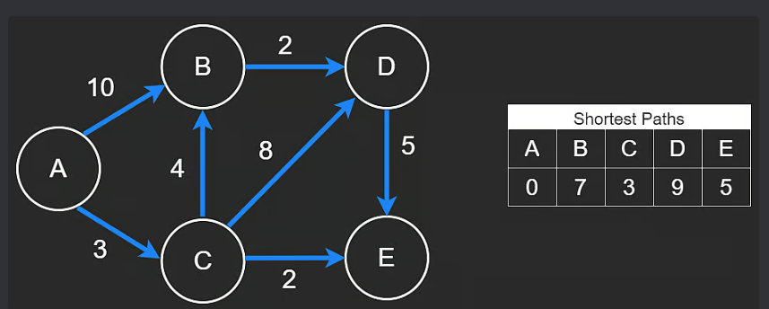

## Graphs 

### Topics to cover:
- [Beginner] Introduction to graphs <input type="checkbox" checked></button>
- [Beginner] DFS algorithm <input type="checkbox" checked></button>
- [Beginner] BFS algorithm <input type="checkbox" checked></button>
- [Beginner] Adjacency list <input type="checkbox" checked></button>
- [Advanced] Dijkstra's algorithm <input type="checkbox"></button>
- [Advanced] Prim's algorithm <input type="checkbox"></button>
- [Advanced] Kruskal's algorithm <input type="checkbox"></button>
- [Advanced] Topological sort <input type="checkbox"></button>

<br>

| # | Title | Solution | Problem level | Time | Space |
|---| ----- | -------- | ------------- | ---- | ----- |
|  |  |  |  |  |  |
| 8 | [743 - Network Delay Time](https://leetcode.com/problems/network-delay-time/description/) | [C++](https://github.com/Akadil/leetcode/blob/main/graphs/743_networkDelayTime.cpp) | Medium - Dijkstra's | 68% | 15% |
| 7 | [323 - Number of Connected Components in an Undirected Graph](https://leetcode.com/problems/number-of-connected-components-in-an-undirected-graph/description/) | [C++](https://github.com/Akadil/leetcode/blob/main/graphs/323_numberConnectedComponentsUndirectedGraph.cpp) | medium - Union Find | Passed | Passed |
| 6 | [207 - Course Schedule](https://leetcode.com/problems/course-schedule/description/) | [C++](https://github.com/Akadil/leetcode/blob/main/graphs/207_courseSchedule.cpp) | medium - adjacency List | 39% | 25% |
| 5 | [133 - Clone Graph](https://leetcode.com/problems/clone-graph/description/) | [C++](https://github.com/Akadil/leetcode/blob/main/graphs/133_cloneGraph.cpp) | medium - adjacency List | 100% | 53% |
| 4 | [994 - Rotting Oranges](https://leetcode.com/problems/rotting-oranges/description/) | [C++](https://github.com/Akadil/leetcode/blob/main/graphs/994_rottingOranges.cpp) | medium - BFS | 60% | 43% |
| 3 | [1091 - Shortest Path in Binary Matrix](https://leetcode.com/problems/shortest-path-in-binary-matrix/description/) | [C++](https://github.com/Akadil/leetcode/blob/main/graphs/1091_shortestPathInMatrix.cpp) | medium - BFS | 79% | 55% |
| 2 | [695 - Max Area of Island](https://leetcode.com/problems/max-area-of-island/) | [C++](https://github.com/Akadil/leetcode/blob/main/graphs/695_maxAreaOfIsland.cpp) | medium - DFS | 87% | 65% |
| 1 | [200 - Number of Islands](https://leetcode.com/problems/number-of-islands/description/) | [C++](https://github.com/Akadil/leetcode/blob/main/graphs/200_numberOfIslands.cpp) | medium - DFS | 76% | 75% |


<!-------------- Introduction to Graphs ------------->
<details>
<summary>Introduction to Graphs</summary>

---
It seems like the graphs should be represented as tree nodes, but in the problems, it is represented as an integer to represent several nodes and a matrix to represent edges. 

---
</details>

<!-------------- DFS algorithm ---------------------->
<details>
<summary>DFS algorithm</summary>

---
The main idea is to make a recursion. I use it when I need to check every solution. Recursion, where each function runs the recursion for each possible way

---
</details>

<!-------------- BFS algorithm ---------------------->
<details>
<summary>BFS algorithm</summary>

---
Mainly used for shortest path. The idea is that we make one step, and then store all the next steps inside of something (usually a deque). Then we take a step from a deque and repeat

```c++
    int bfs(vector<vector<int>>& grid) {
        int ROWS = grid.size(), COLS = grid[0].size();
        vector<vector<int>> visit(4, vector<int>(4));
        queue<pair<int, int>> queue;
        queue.push(pair<int, int>(0, 0));
        visit[0][0] = 1;

        int length = 0;
        while (queue.size()) {
            int queueLength = queue.size();
            for (int i = 0; i < queueLength; i++) {
                pair<int, int> curPair = queue.front();
                queue.pop();
                int r = curPair.first, c = curPair.second;
                if (r == ROWS - 1 && c == COLS - 1) {
                    return length;
                }

                // We can directly build the four neighbors
                int neighbors[4][2] = {{r, c + 1}, {r, c - 1}, {r + 1, c}, {r - 1, c}};
                for (int j = 0; j < 4; j++) {
                    int newR = neighbors[j][0], newC = neighbors[j][1];
                    if (min(newR, newC) < 0 || newR == ROWS || newC == COLS
                        || visit[newR][newC] || grid[newR][newC]) {
                        continue;
                    }
                    queue.push(pair<int, int>(newR, newC));
                    visit[newR][newC] = 1;
                }
            }
            length++;
        }
    }
```

---
</details>

<!-------------- Adjacency List ---------------------->
<details>
<summary>Adjacency List</summary>

---
<p>
    Works with directed graphs and easiest way of storing the graph. Also it is a first structure to store several directed edges. 
</p>

---
</details>


<!-------------- Dijkstra's algorithm ---------------------->
<details>
<summary>Dijkstra's algorithm (shortest path)</summary>

---
We use this algorithm to find the shortest path. Usually we use BFS algorithm, but what if the weight of edges is not equal? This is when Dijkstra's algrotihm come in hand



* <b>Question:</b> starting from A, find the length of the shortest path to every other node 
* <b>Solution:</b> Our goal is to start from A and add to minHeap all neighbors of A. Then by popping the min Node from minHeap, we firstly add the node to our table, and secondly add all its neighbors to minHeap again. Then repeat the operation 
* <b>Time complexity: E * logV</b>, where E is number of edges as we have to add go through each node, then logV as we have to pop the min Node from minHeap in each operation
* <b>When to use: </b> Shortest path with some edges. I use this

#### Code implementation
```c++
#include <vector>
#include <unordered_map>
#include <utility>
#include <queue>

using std::vector;
using std::unordered_map;
using std::pair;
using std::make_pair;
using std::priority_queue;
using std::greater;

/**
 * vector<vector<int>> is matrix of [N][3]
*/
unordered_map<int, int> shortestPath(vector<vector<int>>& edges, int n, int src) {
    
    // Set up the proper format (adjacency list). node -> neigbours[]
    unordered_map<int, vector<pair<int, int>>> adj;
    for (int i = 1; i < n + 1; i++) {
        adj[i] = vector<pair<int, int>>();
    }
    for (vector<int> edge : edges) {
        // s = src, d = dst, w = weight
        int s = edge[0], d = edge[1], w = edge[2];
        adj[s].push_back(make_pair(d, w));
    }

    unordered_map<int, int> shortest;
    priority_queue<pair<int,int>, vector<pair<int,int>>, greater<pair<int, int>>> minHeap; 
    minHeap.push({0, src});
    while (!minHeap.empty()) {
        pair<int, int> p = minHeap.top();
        minHeap.pop();
        int w1 = p.first, n1 = p.second;

        if (shortest.count(n1) > 0) {
            continue;
        }
        shortest[n1] = w1;
        for (pair<int, int> p : adj[n1]) {
            int n2 = p.first, w2 = p.second;
            if (shortest.count(n2) == 0) {
                minHeap.push({w1 + w2, n2});
            }
        }
    }
    return shortest;
}
```

</details>